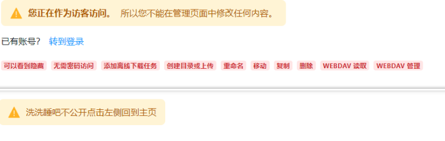

# 第一  AList

> 从代码运行AList并进行编辑

## 一  介绍

> [AList](https://alist.nn.ci) 是一个轻量级的文件列表程序，用于将各种云存储服务中的文件展示在网页界面上。它支持多种云存储平台，并允许用户通过简单的配置将云端存储的内容公开展示或进行管理。AList 特别适合用于将私有或共享的文件、媒体等通过网页方式访问和共享。

### I 主要特征

1. **多平台支持**：AList 支持集成多种云存储服务，如 OneDrive、Google Drive、Aliyun、Dropbox、Baidu Netdisk 等，几乎涵盖了主流的存储服务。
2. **简洁的界面**：AList 的前端界面简洁且用户友好，支持文件的展示、分类、下载等操作。
3. **跨平台**：AList 是一个基于 Go 语言开发的程序，支持多种操作系统平台，包括 Windows、Linux 和 macOS。
4. **多用户支持**：AList 支持多个用户、分级权限管理，允许不同用户对文件和目录具有不同的访问权限。
5. **插件和自定义**：AList 支持通过插件和自定义代码扩展功能，用户可以根据需求增加或修改系统的功能。
6. **高性能**：由于其是用 Go 编写的，它具备较高的性能，能够快速响应文件请求，适用于大规模的文件共享场景。
7. **开源与免费**：AList 是一个开源项目，基于 MIT 协议发布，用户可以免费使用和修改代码。

### II  使用场景：

- **文件共享**：通过 AList，用户可以轻松将个人或团队的文件夹通过网页公开展示，支持多人访问。
- **媒体管理**：对需要共享视频、音频等大文件的用户，AList 提供便捷的在线管理方式。
- **备份和访问**：可以将个人云存储服务上的文件公开为静态网页，供随时访问。

### III  部署方式

AList 支持多种部署方式，可以通过 Docker、二进制文件直接运行，或者在 Linux 服务器上部署。其安装过程简单，只需要少量的配置便可上线使用。

### IV  总结

AList 是一个非常灵活且高效的文件列表解决方案，特别适合需要跨平台文件管理、展示的场景。

## 二  从源码运行

> 其他情况请查看[官网](https://alsit.nn.ci)

### I  环境准备

首先，你需要一个有`git`，`nodejs`，`pnpm`，`golang>=1.20`，`gcc`的环境

所以可以使用使用Github的[Codespaces](https://github.com/codespaces/templates)

进入Codespaces后创建一个空白模板


进入集成终端


用npm安装pnpm `npm install -g pnpm@8.6.10`

> 如果出现  xxxxxx 317 是内存不够导致的

输入示例：

```powershell
@lm1024t ➜ /workspaces/codespaces-blank $ npm install -g pnpm

added 1 package, and audited 2 packages in 2s

1 package is looking for funding
  run `npm fund` for details

found 0 vulnerabilities
```

### II  构建前端

使用 `git clone --recurse-submodules https://github.com/alist-org/alist-web.git` 克隆前端

其次下载语言文件并且初始化

```powershell
cd alist-web 
wget https://crowdin.com/backend/download/project/alist/zh-CN.zip 
unzip zh-CN.zip 
node ./scripts/i18n.mjs
rm zh-CN.zip
```

编译前端文件：请查看目录 ***三  AList前端改代码***

同时安装项目所有依赖：输入命令：`pnpm install && pnpm run build`

### III  编译后端

```powershell
cd ../alist
```

先将编译好的前端文件，移动到后端目录里面，再进行编译

1. 手动将前端里面的dist文件夹，移动到后端public文件夹
2. 或者使用命令将前端里面的dist文件夹，移动到后端public文件夹

```powershell
cp -r /workspaces/codespaces-blank/alist-web/dist /workspaces/codespaces-blank/alist/public/
```

编译后端：

```powershell
appName="alist"
builtAt="$(date +'%F %T %z')"
goVersion=$(go version | sed 's/go version //')
gitAuthor=$(git show -s --format='format:%aN <%ae>' HEAD)
gitCommit=$(git log --pretty=format:"%h" -1)
version=$(git describe --long --tags --dirty --always)
webVersion=$(wget -qO- -t1 -T2 "https://api.github.com/repos/alist-org/alist-web/releases/latest" | grep "tag_name" | head -n 1 | awk -F ":" '{print $2}' | sed 's/\"//g;s/,//g;s/ //g')
ldflags="\
-w -s \
-X 'github.com/alist-org/alist/v3/internal/conf.BuiltAt=$builtAt' \
-X 'github.com/alist-org/alist/v3/internal/conf.GoVersion=$goVersion' \
-X 'github.com/alist-org/alist/v3/internal/conf.GitAuthor=$gitAuthor' \
-X 'github.com/alist-org/alist/v3/internal/conf.GitCommit=$gitCommit' \
-X 'github.com/alist-org/alist/v3/internal/conf.Version=$version' \
-X 'github.com/alist-org/alist/v3/internal/conf.WebVersion=$webVersion' \
"
go build -ldflags="$ldflags" .

```


### IV  结束

右键下载，和正常使用一样

## 三  前端改代码

> 开始修改
> 自己clone前端代码哦，可以在线调试，具体怎么调试也很简单，

### I  先修改 Loading 试试水

**文件位置：**alist-web\src\components\FullLoading.tsx

**查看hope文档链接：**https://hope-ui.com/docs/feedback/spinner

```typescript
  {/* 主要修改内容为 color的参数 具体看上方提到的参数吧 分别大概为11/38/61行 */}
    <Center h="100vh">
      <Spinner
        thickness="4px"
        speed="0.65s"
        //主页圆形加载蓝色条
        emptyColor="tomato"
        //emptyColor="$neutral4"
        //color="tomato"
        color={getMainColor()}
        size="xl"
      />
    </Center>

    <Center ref={props.ref} h="$full" w="$full" py={merged.py}>
      <Spinner
        thickness={`${merged.thickness}px`}
        speed="0.65s"
        //目录白色条
        emptyColor="tomato"
        //emptyColor="$neutral4"
        //color="tomato"
        color={getMainColor()}
        size={merged.size as any}
      />
    </Center>

    <Center w="$full" h="$full">
      {/* 左上角logo加载颜色 */}
      <Spinner color="tomato" {...props} />
    </Center>
```

**修改后的对比预览图：**


### II  修改并且取消在加密码情况下的出现的登录按钮

> 修改取消原因:修改了登录界面和后台入口的地址防止泄露，如何修改登录地址和后台地址~

**文件位置：**alist-web\src\pages\home\Password.tsx

```typescript

{/* 上面是原来的 下面是我自己改的，大概位置在48行，找不到可以用浏览器搜索 */}
          {/* <Text>{t("global.have_account")}</Text> */}
          {/* <Text
            color="$info9"
            as={LinkWithBase}
            href={`/@login?redirect=${encodeURIComponent(location.pathname)}`}
          >
            {t("global.go_login")}
          </Text> */}


          <Text>{t("不公开去要密码或离开")}</Text>
```

**修改后的对比预览图：**


### III 修改了不登录的后台显示

**文件位置：**alist-web\src\pages\manage\users\Profile.tsx

```typescript
{/* 58行开始修改,可查关键字 */}
              <AlertIcon mr="$2_5" />
              {/* <AlertTitle mr="$2_5">{t("users.guest-tips")}</AlertTitle> */}
              <Text>{t("洗洗睡吧不公开")}</Text>
              <Text>{t("点击左侧回到主页")}</Text>
              {/* <AlertDescription>{t("users.modify_nothing")}</AlertDescription> */}
            </Alert>
            <HStack spacing="$2">
              {/* <Text>{t("global.have_account")}</Text> */}
              {/* <Text>{t("洗洗睡吧不公开")}</Text> */}
              {/* <Text
                color="$info9"
                as={LinkWithBase}
                href={`/@login?redirect=${encodeURIComponent(
                  location.pathname
                )}`}
              >
                {t("global.go_login")}
              </Text> */}
              {/* 图片内容可以自己换或者不要都行 */}
              </img>
            </HStack>
            {/* <HStack spacing="$2">
              </img>
            </HStack> */}

          </>
        }
      >


      {/* 137行左右,可查关键词,原来位置显示的内容,红色字体的哪种权限,我这里隐藏了 */}
      {/* <HStack wrap="wrap" gap="$2" mt="$2">
        <For each={UserPermissions}>
          {(item, i) => (
            <PermissionBadge can={UserMethods.can(user(), i())}>
              {t(`users.permissions.${item}`)}
            </PermissionBadge>
          )}
        </For>
      </HStack> */}
```

**修改后的对比预览图：**

上下对比



### IV  取消游客访问和语言选择的按钮默认为简体中文

如何改成默认为简体中文：

首先先拉取中文语言包，丢进去初始化一下

然后英语(en)的直接删除了即可，语言文件夹里面只剩下了 lang/zh_cn 这个中文的 这样就会默认使用中文的

**文件位置：**alist-web\src\pages\login\index.tsx

```typescript
        {/* 177行，取消游客访问 */}
        {/* <Button
          w="$full"
          colorScheme="accent"
          onClick={() => {
            changeToken()
            to(
              decodeURIComponent(searchParams.redirect || base_path || "/"),
              true
            )
          }}
        >
          {t("login.use_guest")}
        </Button> */}


          {/* 198行，Ctrl+F查下面的源码关键字修改，取消语言选择 */}
          {/* <SwitchLanguageWhite /> */}

```

**修改后的对比预览图：**


### V  删除"本地设置"里面的语言切换按钮，已经默认为中文

如何默认中文，看上面我的查看操作

**文件位置：**alist-web\src\pages\login\index.tsx

```typescript
              {/* 第65行隐藏即可 */}
              {/* <SwitchLanguageWhite /> */}
```

### VI  将本地设置里面的夜间/白天 切换模式和刷新按钮(刷新需要登录)移动到主页

**文件位置：**alist-web\src\pages\home\toolbar\Right.tsx

**夜间模式使用的代码位置：**alist-web\src\components\SwitchColorMode.tsx

```typescript
//添加到头部引入那里
// 下面这两条搬过来的代码
import { FiSun as Sun } from "solid-icons/fi";
import { FiMoon as Moon } from "solid-icons/fi";

  // 从这里到下面注释 都是搬过来的夜间模式切换代码,看代码知道加到那里吧？
  const { toggleColorMode } = useColorMode();
  const icon = useColorModeValue(
    {
      size: "$8",
      component: Moon,
      p: "$0_5",
    },
    {
      size: "$8",
      component: Sun,
      p: "$0_5",
    }
  );
  // 到这里


  

    {/* 将设置移动出来,已经没用了这个.... */}
     {/* <Show
        when={isOpen()}
        fallback={
          <RightIcon
              as={AiOutlineSetting}
              tips="local_settings"
              onClick={() => {
                bus.emit("tool", "local_settings");
              }}
            />
        }
      >  
      </Show> */}
      {/* 刷新按钮移动出来 */}
    <VStack spacing="$1" class="left-toolbar-in">
      <Show when={isFolder() && (userCan("write") || objStore.write)}>
        <RightIcon
          as={RiSystemRefreshLine}
          tips="refresh"
          onClick={() => {
            refresh(undefined, true);
          }}
          />
      </Show>    
    </VStack>
      
      {/* 夜间白天模式切换,搜下面的那个class关键词就知道这个加那里了 */}
      <Show
        when={isOpen()}
        fallback={
          <RightIcon
              // 图标已更换
              as={icon().component}
              // tips="白天夜间模式切换"
              onClick={toggleColorMode}
            />
        }
      >  
      </Show>
      
      {/* 以上代码加到这个原有的设置上面即可 */}
      <Show
        when={isOpen()}
        fallback={
          <RightIcon
            class="toolbar-toggle"
            as={CgMoreO}
            onClick={() => {
              onToggle();
            }}
          />
        }
      >
```


**不会加,可以参考这里的完整代码**

```typescript
import {
  Box,
  createDisclosure,
  useColorMode,
  useColorModeValue,
  VStack,
} from "@hope-ui/solid";
import { createMemo, Show } from "solid-js";
import { RightIcon } from "./Icon";
import { CgMoreO } from "solid-icons/cg";
import { TbCheckbox } from "solid-icons/tb";
import { objStore, State, toggleCheckbox, userCan } from "~/store";
import { bus } from "~/utils";
import { operations } from "./operations";
import { IoMagnetOutline } from "solid-icons/io";
import { AiOutlineCloudUpload, AiOutlineSetting } from "solid-icons/ai";
import { RiSystemRefreshLine } from "solid-icons/ri";
import { usePath } from "~/hooks";
import { Motion } from "@motionone/solid";

// 下面这两条搬过来的代码
import { FiSun as Sun } from "solid-icons/fi";
import { FiMoon as Moon } from "solid-icons/fi";

export const Right = () => {
  const { isOpen, onToggle } = createDisclosure({
    defaultIsOpen: localStorage.getItem("more-open") === "true",
    onClose: () => localStorage.setItem("more-open", "false"),
    onOpen: () => localStorage.setItem("more-open", "true"),
  });
  const margin = createMemo(() => (isOpen() ? "$4" : "$5"));
  const isFolder = createMemo(() => objStore.state === State.Folder);
  const { refresh } = usePath();
  // 从这里到下面注释 都是搬过来的夜间模式切换代码
  const { toggleColorMode } = useColorMode();
  const icon = useColorModeValue(
    {
      size: "$8",
      component: Moon,
      p: "$0_5",
    },
    {
      size: "$8",
      component: Sun,
      p: "$0_5",
    }
  );
  // 到这里
  return (
    <Box
      class="left-toolbar-box"
      pos="fixed"
      right={margin()}
      bottom={margin()}
    >
      {/* 将设置移动出来,已经没用了这个.... */}
      {/* <Show
        when={isOpen()}
        fallback={
          <RightIcon
              as={AiOutlineSetting}
              tips="local_settings"
              onClick={() => {
                bus.emit("tool", "local_settings");
              }}
            />
        }
      >  
      </Show> */}
      {/* 刷新按钮移动出来 */}
      <VStack spacing="$1" class="left-toolbar-in">
        <Show when={isFolder() && (userCan("write") || objStore.write)}>
          <RightIcon
            as={RiSystemRefreshLine}
            tips="refresh"
            onClick={() => {
              refresh(undefined, true);
            }}
          />
        </Show>
      </VStack>

      {/* 夜间白天模式切换 */}
      <Show
        when={isOpen()}
        fallback={
          <RightIcon
            // 图标已更换
            as={icon().component}
            // tips="白天夜间模式切换"
            onClick={toggleColorMode}
          />
        }
      >
      </Show>
      {/* 原有的设置 */}
      <Show
        when={isOpen()}
        fallback={
          <RightIcon
            class="toolbar-toggle"
            as={CgMoreO}
            onClick={() => {
              onToggle();
            }}
          />
        }
      >
        <VStack
          class="left-toolbar"
          p="$1"
          rounded="$lg"
          spacing="$1"
          // shadow="0px 10px 30px -5px rgba(0, 0, 0, 0.3)"
          // bgColor={useColorModeValue("white", "$neutral4")()}
          bgColor="$neutral1"
          as={Motion.div}
          initial={{ opacity: 0, scale: 0.9 }}
          animate={{ opacity: 1, scale: 1 }}
          exit={{ opacity: 0, scale: 0.6 }}
          // @ts-ignore
          transition={{ duration: 0.2 }}
        >
          <VStack spacing="$1" class="left-toolbar-in">
            <Show when={isFolder() && (userCan("write") || objStore.write)}>
              {/* <Add /> */}
              {/* 原本的刷新按钮隐藏了 */}
              {/* <RightIcon
                as={RiSystemRefreshLine}
                tips="refresh"
                onClick={() => {
                  refresh(undefined, true);
                }}
              /> */}
              <RightIcon
                as={operations.new_file.icon}
                tips="new_file"
                onClick={() => {
                  bus.emit("tool", "new_file");
                }}
              />
              <RightIcon
                as={operations.mkdir.icon}
                p="$1_5"
                tips="mkdir"
                onClick={() => {
                  bus.emit("tool", "mkdir");
                }}
              />
              <RightIcon
                as={AiOutlineCloudUpload}
                tips="upload"
                onClick={() => {
                  bus.emit("tool", "upload");
                }}
              />
            </Show>
            <Show when={isFolder() && userCan("offline_download")}>
              <RightIcon
                as={IoMagnetOutline}
                pl="0"
                tips="offline_download"
                onClick={() => {
                  bus.emit("tool", "offline_download");
                }}
              />
            </Show>
            <RightIcon
              tips="toggle_checkbox"
              as={TbCheckbox}
              onClick={toggleCheckbox}
            />
            {/* 设置隐藏,移动出去 */}
            <RightIcon
              as={AiOutlineSetting}
              tips="local_settings"
              onClick={() => {
                bus.emit("tool", "local_settings");
              }}
            />
          </VStack>
          <RightIcon tips="more" as={CgMoreO} onClick={onToggle} />
        </VStack>
      </Show>
    </Box>
  );
};

```

**修改后的对比预览图：**


### VII  将登录页面的 "登录到" 隐藏，后期适配自己的使用

**文件位置：**alist-web\src\pages\login\index.tsx

```typescript
  const title = createMemo(() => {
    // 33行左右取消后台显示的 登录到 字样
    // ${t("login.login_to")} 汉化包里面的登录到字样 "login_to": "登录到",
    // ${getSetting("site_title")} 网站标题
    // return `${t("login.login_to")}`
    // return `${t("login.login_to")} ${getSetting("site_title")}`
    return `${getSetting("site_title")}`
  })
```

### VIII  .ipa界面添加下载和复制链接按钮,同时添加巨魔安装按钮

**文件位置：**alist-web\src\pages\home\previews\ipa.tsx

> 两个按钮来自 alist-web\src\pages\home\previews\download.tsx

巨魔安装相关的已经合并，大于v3.13.1以上的版本会实装(不包含v3.13.1

直接把代码复制粘贴完事儿~

```typescript
// import { Button } from "@hope-ui/solid"
import { Button, HStack } from "@hope-ui/solid"
import { createSignal } from "solid-js"
// import { useT } from "~/hooks"
import { ObjStore, objStore } from "~/store"
import { api, baseName, safeBtoa } from "~/utils"
import { FileInfo } from "./info"
import { useCopyLink, useLink, useT } from "~/hooks"


const Ipa = () => {
  const t = useT()
  const [installing, setInstalling] = createSignal(false)
  const [trInstalling, setTrInstalling] = createSignal(false)
  const { copyCurrentRawLink } = useCopyLink()
  const { currentObjLink } = useLink()
  return (
    <FileInfo>
      <HStack spacing="$2">
        {/* 原生IPA安装 */}
        <Button
          as="a"
          href={
            "itms-services://?action=download-manifest&url=" +
            `${api}/i/${safeBtoa(
              encodeURIComponent(objStore.raw_url) +
                "/" +
                baseName(encodeURIComponent(objStore.obj.name))
            )}.plist`
          }
          onClick={() => {
            setInstalling(true)
          }}
        >
          {t(`home.preview.${installing() ? "installing" : "install"}`)}
        </Button>
        {/* 巨魔测试 | use install TrollStore IPA*/}
        <Button
          as="a"
          colorScheme="primary"
          href={
            "apple-magnifier://install?url=" +
            encodeURIComponent(currentObjLink(true))
          }
          onClick={() => {
            setTrInstalling(true)
          }}
        >
          {t(`home.preview.${trInstalling() ? "tr-installing" : "tr-install"}`)}
        </Button>

        {/* 从这里到
        下载按钮文件拷贝的位置
          alist-web\src\pages\home\previews\download.tsx
         primary  青绿色
         accent   紫色
         neutral  灰色
         success  绿色
         info     无？
         warning  橙色
         danger   红色
         */}
        <Button colorScheme="danger" as="a" href={objStore.raw_url} target="_blank">
          {t("home.preview.download")}
        </Button>
        <Button colorScheme="accent" onClick={() => copyCurrentRawLink(true)}>
          {t("home.toolbar.copy_link")}
        </Button>
      </HStack>
      {/* 到这里 还有开头的 <HStack spacing="$2"> 都是自己加的 */}
    </FileInfo>
  )
}

export default Ipa
```

**修改后的对比预览图：**


> 目前仅支持 .ipa文件 若想支持 .tipa文件需要添加

**源码路径：**alist-web\src\pages\home\previews\index.ts

需要将 tipa文件也添加进去

```typescript
	{
    name: "Ipa",
    exts: ["ipa","tipa"],
    component: lazy(() => import("./ipa")),
  },
```

.tipa 文件添加图标样式

**源码路径：**alist-web\src\utils\icon.ts 

添加一下后缀文件名在里面即可

```typescript
  "dmg,ipa,plist,tipa": BsApple,
```

### IX  去掉底部内容（有原因的）

> 这里去掉还是有原因的，因为我们修改了后台地址和登录地址
>
> 但是呢不知道出于什么原因，我们修改了后台管理地址，但是输入 URL/@manage 还是能进入默认界面，虽然进入了默认界面，提示路径不对，也不知道账号密码，但是通过CSS自定义的内容全部失效了，底部的登录（管理）入口出现了，暴露了我们修改后的 登录（管理）地址
>
> 特此直接从根将这个能暴露我们后台登录地址的信息除掉
>
> 但是要自己在底部自定义一个底部信息哦~保留一下版权信息~

**不会加的去目录  *五 自定义内容代码***

**文件位置：**alist-web\src\pages\home\Footer.tsx

```typescript
	{/*
      <HStack spacing="$1">
        <Anchor href="https://github.com/Xhofe/alist" external>
          {t("home.footer.powered_by")}
        </Anchor>
        <span>|</span>
        <AnchorWithBase
          as={Link}
          href={UserMethods.is_guest(user()) ? "/@login" : "/@manage"}
        >
          {t(
            UserMethods.is_guest(user()) ? "login.login" : "home.footer.manage"
          )}
        </AnchorWithBase>
      </HStack>
	*/}
 
```

**修改后的对比预览图：**


> 虽然我们修改了后台的地址，但是我们输入后但是还是进入一个没有使用CSS的前端界面，
>
> 中间虽然提示报错了，找不到这个路径，但是只要输入以 URL/@manageXX，XX是任意信息，哪怕不加XX信息也能，就能出现底部的管理（登录）地址，这样我们之前修改后的登录（管理）入口就会出现。
>
> 虽然就算这样搞了，真的大佬也会找到入口吧，
>
> 具体是为什么我也不晓得啥原因..因为我也懒(不)得(会)分析...哈哈 反正这样能把这个问题解决就行...

### X  修改一下搜索，变的更加匹配 ✅

此版本用于最新版搜索源码修改 

> 前端最新commit ID：5c5e3cc

**文件位置：**alist-web\src\pages\home\header\Header.tsx

很简单，主要是将46行-72行隐藏这是原来的

然后添加新的代码74-102行代码

代码中使用了其他的图标库，觉得不好看的可以自行修改并且记得导入不然会报错

**上述使用的图标库地址：**https://solid-icons.vercel.app/search/search

```typescript
import {
  HStack,
  useColorModeValue,
  Image,
  Center,
  Icon,
  Kbd,
  IconButton,
} from "@hope-ui/solid"
import { Show, Switch, Match } from "solid-js"
import { getMainColor, getSetting, layout, objStore, State } from "~/store"
import { BsSearch } from "solid-icons/bs"
import { CenterLoading } from "~/components"
import { Container } from "../Container"
import { bus } from "~/utils"
import { Layout } from "./layout"
import { AiOutlineFileSearch } from "solid-icons/ai"
import { TbListSearch } from "solid-icons/tb"
import { CgImage } from "solid-icons/cg"

export const Header = () => {
  const logos = getSetting("logo").split("\n")
  const logo = useColorModeValue(logos[0], logos.pop())
  return (
    <Center
      class="header"
      w="$full"
      // shadow="$md"
    >
      <Container>
        <HStack
          px="calc(2% + 0.5rem)"
          py="$2"
          w="$full"
          justifyContent="space-between"
        >
          <HStack class="header-left" h="44px">
            <Image
              src={logo()!}
              h="$full"
              w="auto"
              fallback={<CenterLoading />}
            />
          </HStack>
          <HStack class="header-right" spacing="$2">
            <Show when={objStore.state === State.Folder}>
              {/* <HStack
                aria-label="Search"
                // 背景色
                bg="$neutral4"
                // 长度
                // w="$32"
                // 方框
                p="$2"
                // 圆角
                rounded="$md"
                color={getMainColor()}
                justifyContent="space-between"
                border="2px solid transparent"
                cursor="pointer"
                _hover={{
                  borderColor: "$info6",
                }}
                onClick={() => {
                  bus.emit("tool", "search")
                }}
              >
                <Icon as={AiOutlineFileSearch} />
                <HStack>
                  <Kbd>Ctrl</Kbd>
                  <Kbd>K</Kbd>
                </HStack>
              </HStack> */}
              <IconButton
                aria-label="Search"
                compact
                size="lg"
                // 自带的搜索原本只能显示两个图标下面的换成了三个
                // icon={
                //   <Show when={layout() === "list"} fallback={<TbListSearch />}>
                //     <AiOutlineFileSearch /> 
                //   </Show>
                // }
                
                //这次支持三个不同的图标了
                icon={
                  <Switch>
                    <Match when={layout() === "list"}>
                      <TbListSearch />
                    </Match>
                    <Match when={layout() === "grid"}>
                      <AiOutlineFileSearch />
                    </Match>
                    <Match when={layout() === "image"}>
                      <CgImage />
                    </Match>
                  </Switch>
                }
                onClick={() => {
                  bus.emit("tool", "search")
                }}
              />
              {/* 搜索右侧的那个变换的按钮 */}
              <Layout />
            </Show>
          </HStack>
        </HStack>
      </Container>
    </Center>
  )
}
```

**预览图：**


### XI  修改文件图标

**源码位置：**alist-web\src\utils\icon.ts

**图标库：**https://solid-icons.vercel.app/

```typescript
import {
  BsFileEarmarkWordFill,
  BsFileEarmarkExcelFill,
  BsFileEarmarkPptFill,
  BsFileEarmarkPdfFill,
  BsFileEarmarkPlayFill,
  BsFileEarmarkMusicFill,
  BsFileEarmarkFontFill,
  BsFileEarmarkImageFill,
  BsFileEarmarkMinusFill,
  BsApple,
  BsWindows,
  BsFileEarmarkZipFill,
  BsMarkdownFill,
  BsFiletypeYml,
  BsFiletypeXml
} from "solid-icons/bs"
import { 
  SiAdobephotoshop, 
  SiAdobepremierepro,
  SiAdobeillustrator,
  SiAdobeaftereffects,
  SiAdobeaudition,
  SiAdobeindesign,
  SiTypescript,
  SiGnubash,
  SiJavascript,
  SiPhp
} from "solid-icons/si"
import {
  FaSolidDatabase,
  FaSolidBook,
  FaSolidCompactDisc,
} from "solid-icons/fa"
import { IoFolder } from "solid-icons/io"
import { ImAndroid } from "solid-icons/im"
import { Obj, ObjType } from "~/types"
import { ext } from "./path"
import { FaBrandsGolang,FaBrandsJava,FaBrandsPython } from 'solid-icons/fa'
import { BiSolidFileJson,BiSolidFileCss,BiSolidFileHtml } from 'solid-icons/bi'

//下面是我使用的图标示例，也要添加上面对应的库导入进来喔
const iconMap = {
  "dmg,ipa,plist,tipa": BsApple,
  "exe,msi": BsWindows,
  "zip,gz,rar,7z,tar,jar,xz": BsFileEarmarkZipFill,
  apk: ImAndroid,
  "db,db-shm,db-wal,sql": FaSolidDatabase,
  md: BsMarkdownFill,
  epub: FaSolidBook,
  iso: FaSolidCompactDisc,
  m3u8: BsFileEarmarkPlayFill,
  "doc,docx": BsFileEarmarkWordFill,
  "xls,xlsx,csv": BsFileEarmarkExcelFill,
  "ppt,pptx": BsFileEarmarkPptFill,
  pdf: BsFileEarmarkPdfFill,
  // Adobe
  "psd,pdd": SiAdobephotoshop,
  prproj: SiAdobepremierepro,
  "ai,ait,eps,epsf,ps": SiAdobeillustrator,
  aep: SiAdobeaftereffects,
  sesx: SiAdobeaudition,
  indd: SiAdobeindesign,
  // code
  go: FaBrandsGolang,
  java: FaBrandsJava,
  pnp:SiPhp,
  "py,pyc,pyo,pyi,pyw,pyd,pyx": FaBrandsPython,
  "ts,tsx": SiTypescript, 
  "yaml,yml,toml": BsFiletypeYml,
  xml:BsFiletypeXml,
  sh: SiGnubash,
  json: BiSolidFileJson,
  "js,mjs,cjs": SiJavascript,
  css:BiSolidFileCss,
  html:BiSolidFileHtml,
}
```

**修改后的对比预览图：**


### XII  修改默认为某"视图"方式

首页默认视图为 "列表 list" 格式，有的小伙伴想着默认为 "网格格式" 怎么办呢? 改源码呗....

**文件位置：**alist-web\src\store\obj.ts

```typescript
export type LayoutType = "list" | "grid" | "image"
const [layout, setLayout] = createStorageSignal<LayoutType>("layout","list")
```

大概在177行左右，可能有变化会浮动代码行数，代码是不会变的

> 默认这里是 "list" ，如果你要默认为  "网格视图" 自己改成  "grid" 即可，"image" 是图片视图估计没人默认用

**修改后的对比预览图：**

就像这样的上面是网格视图 下面的是列表视图，默认是列表视图的哦~


### $ 修改后台地址和登录地址

就没代码了，自己批量替换即可~
`@login` 是登录地址，`@manage` 是后台地址


## 四  自定义头部代码

### I  自定义头部代码

```html
<!--Alist V3建议添加的，已经默认添加了，如果你的没有建议加上-->
<script src="https://polyfill.io/v3/polyfill.min.js?features=String.prototype.replaceAll"></script>

<!--引入字体，全局字体使用-->
<link rel="stylesheet" href="https://npm.elemecdn.com/lxgw-wenkai-webfont@1.1.0/lxgwwenkai-regular.css" />

<!--评论系统使用的js-->
<script src='https://unpkg.com/valine/dist/Valine.min.js'></script>

<!--不蒜子计数器-->
<script async src="https://busuanzi.icodeq.com/busuanzi.pure.mini.js"></script>

<!-- Font6，自定义底部使用的图标和字体文件-->
<link type='text/css' rel="stylesheet" href="https://npm.elemecdn.com/font6pro@6.0.1/css/fontawesome.min.css" media='all'>
<link href="https://npm.elemecdn.com/font6pro@6.0.1/css/all.min.css" rel="stylesheet">

<!--音乐播放器所用的文件-->
<!-- require APlayer -->
<link rel="stylesheet" href="https://npm.elemecdn.com/aplayer@1.10.1/dist/APlayer.min.css">
<script src="https://npm.elemecdn.com/aplayer@1.10.1/dist/APlayer.min.js"></script>
<!-- require MetingJS -->
<script src="https://npm.elemecdn.com/meting@2.0.1/dist/Meting.min.js"></script>

<style>
/* 去除通知栏 右上角 X */
.notify-render .hope-close-button {
    display: none;
}
/* 图片API用法点进去都会有食用说明的
  樱花：https://www.dmoe.cc
  夏沫：https://cdn.seovx.com
  搏天：https://api.btstu.cn/doc/sjbz.php
  姬长信：https://github.com/insoxin/API
  小歪：https://api.ixiaowai.cn/
  保罗：https://api.paugram.com
  墨天逸：https://api.mtyqx.cn
  岁月小筑：https://img.xjh.me
  东方Project：https://img.paulzzh.com
  */

/*白天背景图*/
.hope-ui-light {
    background-image: url("https://api.ixiaowai.cn/mcapi/mcapi.php") !important;
    background-repeat:no-repeat;
    background-size:cover;
    background-attachment:fixed;
    background-position-x:center;
}
/*夜间背景图*/
.hope-ui-dark {
    background-image: url(http://pic.rmb.bdstatic.com/bjh/ebe942a9de49856f389c65f25a338335.png) !important;
    background-repeat:no-repeat;
    background-size:cover;
    background-attachment:fixed;
    background-position-x:center;
}
/*主列表白天模式透明*/
.obj-box.hope-stack.hope-c-dhzjXW.hope-c-PJLV.hope-c-PJLV-igScBhH-css {
    background-color: rgba(255, 255, 255, 0.5)!important;
}
/*主列表夜间模式透明*/
 .obj-box.hope-stack.hope-c-dhzjXW.hope-c-PJLV.hope-c-PJLV-iigjoxS-css {
    background-color:rgb(0 0 0 / 50%)!important;
}

/*readme白天模式透明*/
.hope-c-PJLV.hope-c-PJLV-ikSuVsl-css {
    background-color: rgba(255, 255, 255, 0.5)!important;
}
/*readme夜间模式透明*/
.hope-c-PJLV.hope-c-PJLV-iiuDLME-css {
    background-color:rgb(0 0 0 / 50%)!important;
}

/*顶部右上角切换按钮透明*/
.hope-ui-light .hope-c-ivMHWx-hZistB-cv.hope-icon-button {
    background-color: rgba(255, 255, 255, 0.3)!important;
}
.hope-ui-dark .hope-c-ivMHWx-hZistB-cv.hope-icon-button {
    background-color:rgb(0 0 0 / 10%)!important;
	
}

/*右下角侧边栏按钮透明 第一个是白天 第二个是夜间*/
.hope-ui-light .hope-c-PJLV-ijgzmFG-css {
    background-color: rgba(255, 255, 255, 0.5)!important;
}
.hope-ui-dark .hope-c-PJLV-ijgzmFG-css {
    background-color:rgb(0 0 0 / 50%)!important;
}

/*白天模式代码块透明*/
.hope-ui-light pre {
    background-color: rgba(255, 255, 255, 0.1)!important;
}
/*夜间模式代码块透明*/
.hope-ui-dark pre {
    background-color: rgba(255, 255, 255, 0)!important;
}

/*底部CSS，.App .table这三个一起的*/
 dibu {
    border-top: 0px;
    position: absolute;
    bottom: 0;
    width: 100%;
    margin: 0px;
    padding: 0px;
}
.App {
    min-height: 85vh;
}
.table {
    margin: auto;
}

/*去掉底部*/
.footer {
    display: none!important;
}

/*全局字体*/
 * {
    font-family:LXGW WenKai
}
* {
    font-weight:bold
}
body {
    font-family: LXGW WenKai;
}


/*以下为评论系统专用*/
/*适配大小契合度*/
.newValine {
    width: min(96%, 940px);
    flex-direction: column;
    row-gap: var(--hope-space-2);
    border-radius: var(--hope-radii-xl);
    padding: var(--hope-space-2);
    box-shadow: var(--hope-shadows-lg);
}
/*评论区 - 白天模式透明度*/
.hope-ui-light .newValine {
    background-color: rgba(255, 255, 255, 0.8)!important;
}
/*评论区 - 夜间模式透明度*/
.hope-ui-dark .newValine {
    background-color:rgb(0 0 0 / 80%)!important;
}
/*输入栏里面跳舞的小人背景图*/
.vedit {
    background-image:url(https://cdn.jsdelivr.net/gh/anwen-anyi/imgAnwen/images/OuNiJiang.gif);
    background-size:contain;
    background-repeat:no-repeat;
    background-position:right bottom;
    transition:all 0.25s ease-in-out 0s;
}
textarea#comment-textarea:focus {
    background-position-y:120px;
    transition:all 0.25s ease-in-out 0s;
}


/*渐变背景CSS*/
 #canvas-basic {
    position: fixed;
    display: block;
    width: 100%;
    height: 100%;
    top: 0;
    right: 0;
    bottom: 0;
    left: 0;
    z-index: -999;
}


/*音乐播放器进一步进行隐藏*/
.aplayer.aplayer-fixed.aplayer-narrow .aplayer-body {
    left: -66px!important;
}
.aplayer.aplayer-fixed.aplayer-narrow .aplayer-body:hover {
    left: 0!important;
}
</style>

```

### II  搜索栏美化代码

**带毛玻璃效果**

```CSS
<style>
/*白天模式 搜索主体+毛玻璃*/
.hope-ui-light .hope-c-PJLV-iiBaxsN-css{
   background-color: rgba(255,255,255,0.2)!important;
   backdrop-filter: blur(10px)!important;
}

/*白天模式 搜索栏输入框+毛玻璃*/
.hope-ui-light .hope-c-kvTTWD-hYRNAb-variant-filled{
   background-color: rgba(255,255,255,0.2)!important;
   backdrop-filter: blur(10px)!important;
}

/*白天模式 搜索按钮+毛玻璃*/
.hope-ui-light .hope-c-PJLV-ikEIIxw-css{
   background-color: rgba(255,255,255,0.2)!important;
   backdrop-filter: blur(10px)!important;
   padding: var(--hope-space-1)!important;
}

/*夜间模式搜索主体+毛玻璃*/
.hope-ui-dark .hope-c-PJLV-iiBaxsN-css{
    background-color: rgb(0 0 0 / 10%)!important;
    backdrop-filter: blur(10px)!important;
}

/*夜间模式搜索栏+毛玻璃*/
.hope-ui-dark .hope-c-kvTTWD-hYRNAb-variant-filled{
    background-color: rgb(0 0 0 / 10%)!important;
    backdrop-filter: blur(10px)!important;
}

/*夜间模式 搜索按钮+毛玻璃*/
.hope-ui-dark .hope-c-PJLV-ikEIIxw-css{
    background-color: rgb(0 0 0 / 10%)!important;
    backdrop-filter: blur(10px)!important;
    padding: var(--hope-space-1)!important;
}
</style>
```

**不带毛玻璃效果**

```css
<style>
/*白天模式 搜索主体*/
.hope-ui-light .hope-c-PJLV-iiBaxsN-css{
   background-color: rgba(255,255,255,0.2)!important;
}

/*白天模式 搜索栏输入框*/
.hope-ui-light .hope-c-kvTTWD-hYRNAb-variant-filled{
   background-color: rgba(255,255,255,0.2)!important;
}

/*白天模式 搜索按钮*/
.hope-ui-light .hope-c-PJLV-ikEIIxw-css{
   background-color: rgba(255,255,255,0.2)!important;
   padding: var(--hope-space-1)!important;
}

/*夜间模式搜索主体*/
.hope-ui-dark .hope-c-PJLV-iiBaxsN-css{
    background-color: rgb(0 0 0 / 10%)!important;
}

/*夜间模式搜索栏*/
.hope-ui-dark .hope-c-kvTTWD-hYRNAb-variant-filled{
    background-color: rgb(0 0 0 / 10%)!important;
}

/*夜间模式 搜索按钮*/
.hope-ui-dark .hope-c-PJLV-ikEIIxw-css{
    background-color: rgb(0 0 0 / 10%)!important;
    padding: var(--hope-space-1)!important;
}
</style>
```

**效果预览**


### III  自行替换鼠标样式说明

> **因为CDN的 HTTPS证书失效了，无法使用暂时**
>
> **但是着急的话可以一个一个点击然后把哪个文件下载下来，然后自己上传一个换成自己的链接也可以..**

```html
<!--较为个性化的鼠标指针样式，可结合个人需要自行修改-->
<style>
  body {
    cursor: url(http://luluossfile.lulufind.com/work/teacher_u20221021b3a89013_1666841028833_10660845_file.cur), default;
  }
  select{
    cursor: url(http://luluossfile.lulufind.com/work/teacher_u2021090299b56677_1666842679271_10490748_file.cur), pointer;
  }
  button,a:hover{
    cursor: url(http://luluossfile.lulufind.com/work/teacher_u20221017ac9f1124_1666842626270_11086578_file.cur), pointer;
  }
  input{
    cursor:url(http://luluossfile.lulufind.com/work/teacher_u2021090299b56677_1666842633386_14976764_file.cur), text;	
  }
  textarea,input:focus{
    cursor:url(http://luluossfile.lulufind.com/work/teacher_u202210176ba36766_1666842640146_15845280_file.cur), text;	
  }
  code{
    cursor: url(http://luluossfile.lulufind.com/work/teacher_u20221021b3a89013_1666842646779_15864973_file.cur), default;	
  }
  pre>code{
    cursor: url(http://luluossfile.lulufind.com/work/teacher_u202210176ba36766_1666842653500_10010236_file.cur), default;	
  }
</style>
```


## 五  自定义内容代码

### I  自定义内容内代码

```html
<!--延迟加载-->
<!--如果要写自定义内容建议都加到这个延迟加载的范围内-->
<div id="customize" style="display: none;">
    <div>
		<!--音乐播放器-->
        <meting-js fixed="true" autoplay="false" theme="#409EFF" list-folded="true" auto="QQ音乐或者网易云的链接"></meting-js>
		
		<!--评论模块还有下面的script也是-->
		<center>
			<div class="newValine" id="vcomments"></div>
		</center>
		<script>
			new Valine({
				visitor: true,
				el: '#vcomments',
				avatar: 'wavatar',
				appId: 'Your appId',
				appKey: 'Your appKey',
				placeholder: "有什么问题欢迎评论区留言~么么哒"
			}) 
		</script>

        <br />
        <center class="dibu">
            <div style=" line-height: 20px;font-size: 9pt;font-weight: bold;">
                <span>
                    "
                    <span style="color: rgb(13, 109, 252); font-weight: bold;" id="hitokoto">
                        <a href="#" id="hitokoto_text">
                            "人生最大的遗憾,就是在最无能为力的时候遇到一个想要保护一生的人."
                        </a>
                    </span> "
                </span>
                <p style="margin-left: 10rem;font-size: 8pt;">
                    <small>
                        —— Anwen's Cloud
                    </small>
                </p>
            </div>

            <div style="font-size: 13px; font-weight: bold;">
                <span class="nav-item">
                    <a class="nav-link" href="xxxxxxxxxx"
                        target="_blank">
                        <i class="fab fa-qq" style="color:#409EFF" aria-hidden="true">
                        </i>
                        QQ |
                    </a>
                </span>
                <span class="nav-item">
                    <a class="nav-link" href="mailto:xxxxx@foxmail.com" target="_blank">
                        <i class="fa-duotone fa-envelope-open" style="color:#409EFF" aria-hidden="true">
                        </i>
                        邮箱 |
                    </a>
                </span>
                <span class="nav-item">
                    <a class="nav-link" href="xxxxxx" target="_blank">
                        <i class="fas fa-edit" style="color:#409EFF" aria-hidden="true">
                        </i>
                        博客 |
                    </a>
                </span>
                <span class="nav-item">
                    <a class="nav-link" href="xxxxxxxx" target="_blank">
                        <i class="fas fa-comment-lines" style="color:#409EFF;" aria-hidden="true">
                        </i>
                        留言 |
                    </a>
                </span>
                <span class="nav-item">
                    <a class="nav-link" href="xxxxxxx" target="_blank">
                        <i class="fa fa-cloud-download" style="color:#409EFF;" aria-hidden="true">
                        </i>
                        云盘 |
                    </a>
                </span>
                <!--后台入口-->
                <span class="nav-item">
                    <a class="nav-link" href="/@manage" target="_blank">
                        <i class="fa-solid fa-folder-gear" style="color:#409EFF;" aria-hidden="true">
                        </i>
                        管理 |
                    </a>
                </span>
                <!--版权，请尊重作者-->
                <span class="nav-item">
                    <a class="nav-link" href="https://github.com/Xhofe/alist" target="_blank">
                        <i class="fa-solid fa-copyright" style="color:#409EFF;" aria-hidden="true">
                        </i>
                        Alist
                    </a>
                </span>
				<br />
				<!--添加一个访问量-->
				<span>
                    本"<span style="color: rgb(13, 109, 252); font-weight: bold;"><a href="#">目录</a></span>"访问量 <span id="busuanzi_value_page_pv" style="color: rgb(13, 109, 252); font-weight: bold;"></span> 次 本站总访问量 <span id="busuanzi_value_site_pv" style="color: rgb(13, 109, 252); font-weight: bold;"></span>                次 本站总访客数 <span id="busuanzi_value_site_uv" style="color: rgb(13, 109, 252); font-weight: bold;"></span> 人
                </span>
                <br />
				<!--添加备案信息-->
                <span class="nav-item">
                    <a class="nav-link" href="https://beian.miit.gov.cn/#/Integrated/index" target="_blank">
                        <i class="fa-solid fa-shield-check" style="color:#409EFF;" aria-hidden="true">
                        </i>
                        冀 ICP备2222000777号
                    </a>
                </span>
            </div>
        </center>
        <br />
        <br />
    </div>


    <!--一言API-->
    <script src="https://v1.hitokoto.cn/?encode=js&select=%23hitokoto" defer></script>
<!--延迟加载范围到这里结束-->
</div>
<!--延迟加载配套使用JS-->
<script>
    let interval = setInterval(() => {
        if (document.querySelector(".footer")) {
            document.querySelector("#customize").style.display = "";
            clearInterval(interval);
        }
    }, 200);
</script>

<!-- 渐变背景初始化,如果要使用渐变背景把下面的那一行注释去掉即可-->
<!-- 下面的几行都是渐变的一套,自定义头部内还有一个关联的自定义CSS -->
<!--<canvas id="canvas-basic"></canvas> -->
<script src="https://npm.elemecdn.com/granim@2.0.0/dist/granim.min.js"></script>
<script>
var granimInstance = new Granim({
    element: '#canvas-basic',
    direction: 'left-right',
    isPausedWhenNotInView: true,
    states : {
        "default-state": {
            gradients: [
                ['#a18cd1', '#fbc2eb'],
                 ['#fff1eb', '#ace0f9'],
                 ['#d4fc79', '#96e6a1'],
                 ['#a1c4fd', '#c2e9fb'],
                 ['#a8edea', '#fed6e3'],
                 ['#9890e3', '#b1f4cf'],
                 ['#a1c4fd', '#c2e9fb'],
                 ['#fff1eb', '#ace0f9']
           
            ]
        }
    }
});
</script>


```

### II  网页点击鼠标特效（两个）

```html
<!-- 网页鼠标点击特效 - 核心价值观关键字 -->
<script>
    (function () {
        var a_idx = 0;
        window.onclick = function (event) {
            var a = new Array("❤富强❤", "❤民主❤", "❤文明❤", "❤和谐❤", "❤自由❤", "❤平等❤", "❤公正❤", "❤法治❤", "❤爱国❤",
                "❤敬业❤", "❤诚信❤", "❤友善❤");
            var heart = document.createElement("b"); //创建b元素
            heart.onselectstart = new Function('event.returnValue=false'); //防止拖动

            document.body.appendChild(heart).innerHTML = a[a_idx]; //将b元素添加到页面上
            a_idx = (a_idx + 1) % a.length;
            heart.style.cssText = "position: fixed;left:-100%;"; //给p元素设置样式

            var f = 13, // 字体大小
                x = event.clientX - f / 2 - 30, // 横坐标
                y = event.clientY - f, // 纵坐标
                c = randomColor(), // 随机颜色
                a = 1, // 透明度
                s = 0.8; // 放大缩小

            var timer = setInterval(function () { //添加定时器
                if (a <= 0) {
                    document.body.removeChild(heart);
                    clearInterval(timer);
                } else {
                    heart.style.cssText = "font-size:16px;cursor: default;position: fixed;color:" +
                        c + ";left:" + x + "px;top:" + y + "px;opacity:" + a + ";transform:scale(" +
                        s + ");";

                    y--;
                    a -= 0.016;
                    s += 0.002;
                }
            }, 15)
        }
        // 随机颜色
        function randomColor() {
            return "rgb(" + (~~(Math.random() * 255)) + "," + (~~(Math.random() * 255)) + "," + (~~(Math
                .random() * 255)) + ")";
        }
    }());
</script>
```

```html
<!-- 网页鼠标点击特效 - 爱心 -->
<script type="text/javascript">
         ! function (e, t, a) {
            function r() {
                for (var e = 0; e < s.length; e++) s[e].alpha <= 0 ? (t.body.removeChild(s[e].el), s.splice(e, 1)) : (s[
                        e].y--, s[e].scale += .004, s[e].alpha -= .013, s[e].el.style.cssText = "left:" + s[e].x +
                    "px;top:" + s[e].y + "px;opacity:" + s[e].alpha + ";transform:scale(" + s[e].scale + "," + s[e]
                    .scale + ") rotate(45deg);background:" + s[e].color + ";z-index:99999");
                requestAnimationFrame(r)
            }
            function n() {
                var t = "function" == typeof e.onclick && e.onclick;
                e.onclick = function (e) {
                    t && t(), o(e)
                }
            }
 
            function o(e) {
                var a = t.createElement("div");
                a.className = "heart", s.push({
                    el: a,
                    x: e.clientX - 5,
                    y: e.clientY - 5,
                    scale: 1,
                    alpha: 1,
                    color: c()
                }), t.body.appendChild(a)
            }
 
            function i(e) {
                var a = t.createElement("style");
                a.type = "text/css";
                try {
                    a.appendChild(t.createTextNode(e))
                } catch (t) {
                    a.styleSheet.cssText = e
                }
                t.getElementsByTagName("head")[0].appendChild(a)
            }
 
            function c() {
                return "rgb(" + ~~(255 * Math.random()) + "," + ~~(255 * Math.random()) + "," + ~~(255 * Math
                    .random()) + ")"
            }
            var s = [];
            e.requestAnimationFrame = e.requestAnimationFrame || e.webkitRequestAnimationFrame || e
                .mozRequestAnimationFrame || e.oRequestAnimationFrame || e.msRequestAnimationFrame || function (e) {
                    setTimeout(e, 1e3 / 60)
                }, i(
                    ".heart{width: 10px;height: 10px;position: fixed;background: #f00;transform: rotate(45deg);-webkit-transform: rotate(45deg);-moz-transform: rotate(45deg);}.heart:after,.heart:before{content: '';width: inherit;height: inherit;background: inherit;border-radius: 50%;-webkit-border-radius: 50%;-moz-border-radius: 50%;position: fixed;}.heart:after{top: -5px;}.heart:before{left: -5px;}"
                ), n(), r()
        }(window, document);
    
</script>
```

### III  音乐播放器添加说明

核心代码（记得引用头部内的喔~）

```html
<meting-js fixed="true" autoplay="false" theme="#409EFF" list-folded="true" auto="https://y.qq.com/n/yqq/playlist/7927599544.html"></meting-js>
```

#### **1  腾讯QQ音乐**

1  https://y.qq.com/n/ryqq/profile/create

2  

3  点击这个歌单后我们能看到 这个歌单的链接是 ：https://y.qq.com/n/ryqq/playlist/7927599544

4  然后我们复制最后的那一串数字 `7927599544`

5  然后回到 https://y.qq.com/n/yqq/playlist/7927599544.html 这个链接里面把里面的数字ID替换成你的即可使用。

#### **2  网易云音乐**

```html
<meting-js 
  server="netease" 
  type="playlist" 
  id="60198">
</meting-js>
```

进入网易云音乐，然后找到你想听的歌单进去，然后看到顶部链接地址栏里面有一串ID，填进代码里面


可以参下除了最下面三个需要加的参数我还添加了跟QQ音乐一样的几个参数

```html
<meting-js 
    fixed="true" 
    autoplay="false" 
    theme="#409EFF" 
    list-folded="true" 
    server="netease" 
    type="playlist" 
    id="2195404116">
  </meting-js>
```

一键复制拿去用即可.

```html
<meting-js fixed="true" autoplay="false" theme="#409EFF" list-folded="true" server="netease" type="playlist" id="2195404116"></meting-js>
```

#### **3  其他音乐**

```html
<meting-js
	name="rainymood"
	artist="rainymood"
	url="https://rainymood.com/audio1110/0.m4a"
	cover="https://rainymood.com/i/badge.jpg">
</meting-js>
```

name，artist，这俩是啥不说了自己研究吧

url 肯定是你要添加的音乐链接，cover封面呗~嘿嘿嘿

#### **4  加上歌词**

```html
<meting-js
	name="rainymood"
	artist="rainymood"
	url="https://rainymood.com/audio1110/0.m4a"
	cover="https://rainymood.com/i/badge.jpg"
	fixed="true">
	<pre hidden>
		[00:00.00]This
		[00:04.01]is
		[00:08.02]lyric
	</pre>
</meting-js>
```

`pre hidden`里面的格式就是歌词~这样就能看到歌词啦，自己掐好时间点儿就行~

#### **5  音乐的一些其他参数**

| **option**      | **default** | **description**                                              |
| --------------- | ----------- | ------------------------------------------------------------ |
| id              | **require** | song id / playlist id / album id / search keyword            |
| server          | **require** | music platform: netease, tencent, kugou, xiami, baidu        |
| type            | **require** | song, playlist, album, search, artist                        |
| auto            | options     | music link, support: netease, tencent, xiami                 |
| fixed           | false       | enable fixed mode                                            |
| mini            | false       | enable mini mode                                             |
| autoplay        | false       | audio autoplay                                               |
| theme           | #2980b9     | main color                                                   |
| loop            | all         | player loop play, values: 'all', 'one', 'none'               |
| order           | list        | player play order, values: 'list', 'random'                  |
| preload         | auto        | values: 'none', 'metadata', 'auto'                           |
| volume          | 0.7         | default volume, notice that player will remember user setting, default volume will not work after user set volume themselves |
| mutex           | true        | prevent to play multiple player at the same time, pause other players when this player start play |
| lrc-type        | 0           | lyric type                                                   |
| list-folded     | false       | indicate whether list should folded at first                 |
| list-max-height | 340px       | list max height                                              |
| storage-name    | metingjs    | localStorage key that store player setting                   |

**机翻的（凑合看吧）**

| **选项**     | **默认** | **描述**                                                     |
| ------------ | -------- | ------------------------------------------------------------ |
| ID           | **要求** | 歌曲ID/播放列表ID/专辑ID/搜索关键字                          |
| 服务器       | **要求** | 音乐平台：netease, tencent, kugou, xiami,baidu               |
| 类型         | **要求** | song, playlist, album, search,artist                         |
| 汽车         | 选项     | 音乐链接，支持：netease,,,tencentxiami                       |
| 固定的       | false    | 启用固定模式                                                 |
| 小型的       | false    | 开启迷你模式                                                 |
| 自动播放     | false    | 音频自动播放                                                 |
| 主题         | #2980b9  | 主色                                                         |
| 环形         | all      | 播放器循环播放，值：'all'、'one'、'none'                     |
| 命令         | list     | 播放器播放顺序，值：'list'，'random'                         |
| 预载         | auto     | 值：“无”、“元数据”、“自动”                                   |
| 体积         | 0.7      | 默认音量，注意播放器会记住用户设置，用户自己设置音量后默认音量将失效 |
| 互斥体       | true     | 防止同时播放多个播放器，当该播放器开始播放时暂停其他播放器   |
| lrc 型       | 0        | 抒情类型                                                     |
| 列表折叠     | false    | 指示列表是否应首先折叠                                       |
| 列表最大高度 | 340px    | 列出最大高度                                                 |
| 存储名称     | metingjs | 存储播放器设置的 localStorage 键                             |

